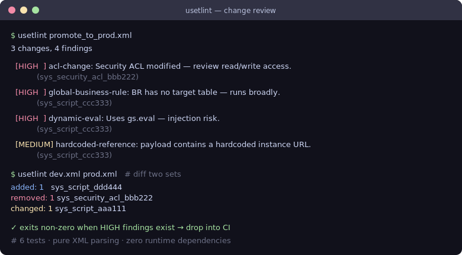

# usetlint — ServiceNow Update Set linter

[](https://github.com/JCreatesGH/sn-updateset-lint/actions)
[](https://www.python.org/)
[](LICENSE)

Review ServiceNow **Update Sets** before you promote them. `usetlint` parses an exported Update Set (unload XML), flags risky changes, and diffs two sets so code review isn't a guessing game. Zero runtime dependencies — drops straight into CI.



## Install

```bash
pip install usetlint
```

## Lint a set

```bash
usetlint promote_to_prod.xml
```

It reports findings by severity and **exits non-zero on any HIGH finding**, so a pipeline can block a risky promotion:

```yaml
- run: pip install usetlint && usetlint update_set.xml
```

## Diff two sets

```bash
usetlint dev.xml prod.xml      # added / removed / changed by record
```

## Rules

| Severity | Rule | Catches |
|----------|------|---------|
| HIGH | `global-business-rule` | Business Rules with no/global target table |
| HIGH | `acl-change` | Modified `sys_security_acl` records |
| HIGH | `dynamic-eval` | `gs.eval` / `new Function` injection smells |
| MEDIUM | `record-delete` | DELETE actions riding along in a promotion |
| MEDIUM | `hardcoded-reference` | Hardcoded instance URLs / credential-like strings |
| LOW | `setworkflow-false` | `setWorkflow(false)` silently skipping business rules |

## Library

```python
from usetlint import parse_update_set, lint, diff_update_sets
findings = lint(parse_update_set(open("set.xml").read()))
```

## Development

```bash
python -m pytest -q   # 6 tests
```

## License

MIT
